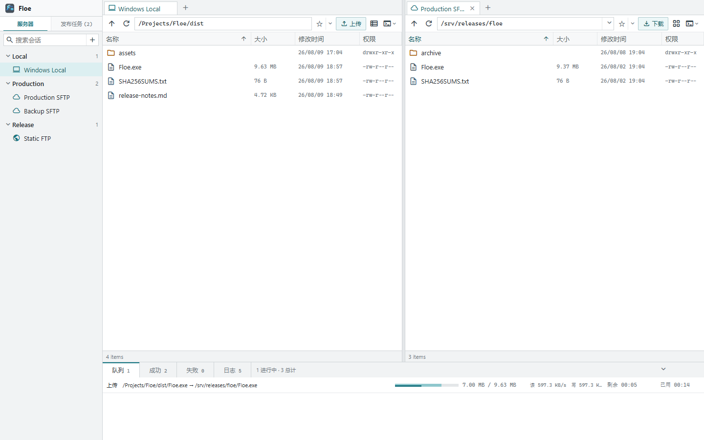
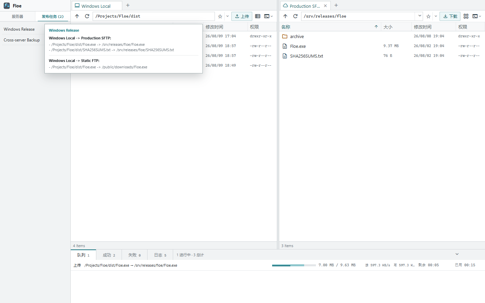
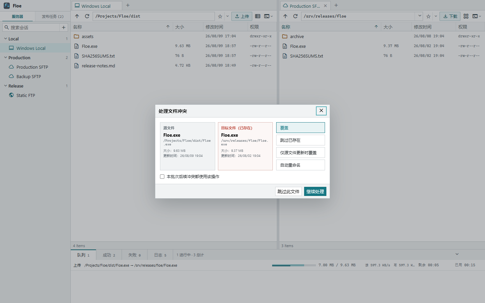

# Floe

Floe 是一个由本地 Go Core 驱动的浏览器文件工作台。当前体验版支持：

- 分组会话树、双文件面板、多本地/远程标签和双向拖放传输。
- 会话先保存后连接；支持 SFTP 和 FTP，SFTP 首次连接显示并确认主机 SHA-256 指纹。
- 会话右键可查看、修改或删除配置；修改已连接会话后会断开旧连接，下次打开时使用新配置连接。
- 会话密码由本机随机 AES-GCM 密钥加密后保存在用户数据目录，不写入明文。
- 跨提供者自适应分块、多路并发传输；SFTP 单文件使用内部请求流水线，目录任务按 Provider 能力控制并发。
- Local/FTP 任务先写隔离的 `.floe-part-*` 临时文件；SFTP 保持兼容性更高的直接路径模式。写入完成后逐块使用远端 SHA-256 或回读校验，再提交任务。
- 可调高度的任务区，按队列、成功和失败分类，支持暂停、恢复、删除和清空历史。
- 传输队列分别显示源端读取速度和目标端写入速度；重试产生的实际 I/O 也会计入统计。
- 上传前可选择覆盖、跳过、仅源文件更新时覆盖、自动重命名或逐个询问；跳过的任务会保留在成功历史中并标记为“已跳过”。
- 传输选项可保存为模板，模板不包含密码或私钥，支持来源/目标会话、冲突策略、并发、校验、目录结构和过滤规则。
- 内置实时操作日志，持久化连接、目录读取、传输和媒体播放错误的详细原因。
- 底部任务区提供“速查”工作台，可用 `Ctrl+K` 随时搜索或记录命令、地址、账号和操作说明；
  支持智能短语与双引号精确搜索、按命中位置加载统一上下文、原始记录编辑、选中文字复制、
  敏感字段隐藏、长内容全屏阅读，以及文本/Markdown 文件导入。
- 速查内容使用独立 AES-GCM 密钥加密保存；可在“位置”中指定知识库存储目录，选择复制
  当前知识库后切换，或直接打开目标目录中已有的知识库。
- UTF-8 远程文本预览与编辑，支持语法高亮、行号、查找替换、行列跳转、未保存提示、
  UTF-8 BOM 与 LF/CRLF 保持、窗口内全屏、冲突检测和原子保存；Markdown 文件可打开
  左侧源码、右侧渲染文档的实时分屏预览；HTML 文件支持实时页面渲染、设备尺寸调整
  和右侧预览全屏。
- 图片预览支持缩放、窗口内全屏和前后切换；列表与超大图标视图均支持图片缩略图。
- MP4 直接播放；使用内置 hls.js 播放 M3U8/HLS，并代理同一 Provider 中的相对分片、子播放列表和密钥文件。
- Windows 本地标签可从盘符目录树选择路径，并可创建多个本地标签。
- 由 Go Core 调用 Windows Terminal，可将 SSH 打开到新标签、当前标签窗格或指定标签窗格。
- SSH 可通过一次性、短时有效的 AskPass 令牌自动输入会话中保存的密码；密码不进入 PowerShell 命令或进程参数。
- Core 已验证过主机指纹后，Windows OpenSSH 会以 `accept-new` 写入首次出现的主机密钥；已记录主机的密钥变化仍会被拒绝。
- 同一 `Floe.exe` 通过 `floe ctl` 提供会话管理、目录、文本读取、日志以及本地/跨服务器并发校验传输，不要求浏览器 UI 正在运行。
- 原生 Windows 托盘菜单和单实例保护，Windows 版不显示 CMD 窗口。
- 托盘可配置启动时是否自动打开浏览器，设置保存在 `settings.json`。

## 界面预览

### 双面板与传输队列



### 发布任务模板



### 文件冲突处理



截图使用匿名演示数据，不包含真实服务器、账号或用户文件。

## 从源码运行

```bash
cd floe
GOPATH="$PWD/.cache/gopath" GOCACHE="$PWD/.cache/go-build" go run ./cmd/floe
```

如果当前环境无法自动打开浏览器：

```bash
GOPATH="$PWD/.cache/gopath" GOCACHE="$PWD/.cache/go-build" \
  go run ./cmd/floe --no-open
```

终端会输出一次性登录地址，将其复制到 Windows 浏览器即可。

## 构建 Windows x86_64

```bash
chmod +x build-windows.sh
./build-windows.sh
```

产物位于 `dist/Floe.exe`。GUI 与 `floe ctl` 共用同一可执行文件；Windows 宿主机不需要安装 Go，
也不会生成 `Floe-new.exe`。

Windows 版本使用 GUI 子系统，不会打开 CMD 窗口。关闭浏览器不会停止 Core；
可通过 Floe 托盘图标重新打开页面、打开 PowerShell 或退出程序。

### 使用 Edge 创建独立应用窗口

Floe 启动后会在本机提供 Web UI：\`http://localhost:7577\`。如果希望像桌面软件
一样使用，可以在 Microsoft Edge 中打开该地址，然后选择地址栏右侧的“应用”菜单
（或 \`…\` 菜单中的“应用”）→“将此站点作为应用安装”。之后可直接从开始菜单或
桌面快捷方式启动 Floe，拥有独立窗口和任务栏图标。

安装完成后，建议在 Floe 托盘菜单中关闭“启动时打开浏览器”。这样 Floe 只负责
启动本地 Core，日后通过 Edge 应用快捷方式打开界面；需要时仍可从托盘菜单重新
打开浏览器。

图标源文件为 `assets/floe-source.png`。修改图标后运行：

```bash
./generate-resources.sh
./build-windows.sh
```

启动后数据默认保存在 `%LOCALAPPDATA%\Floe`。会话保存在 `sessions.json`，
加密密钥保存在 `session.key`，传输任务保存在 `tasks.json`，操作日志保存在
`activity.json`（最多保留 1000 条），传输模板保存在 `transfer-templates.json`，
启动偏好保存在 `settings.json`。
速查知识库默认保存在同一目录下的 `memories.json`，加密密钥为 `memory.key`；在速查工具栏
中修改存储位置后，这两个文件保存在指定目录，路径记录在 `settings.json`。

## 命令行

```powershell
.\Floe.exe ctl version
.\Floe.exe ctl help
.\Floe.exe ctl logs --limit 100
.\Floe.exe ctl sessions
.\Floe.exe ctl session show <会话ID>
.\Floe.exe ctl session add --name build --host 192.0.2.10 --user root --password-stdin
.\Floe.exe ctl session update <会话ID> --keepalive --alive-interval 60 --alive-count 3
.\Floe.exe ctl session delete <会话ID>

# 服务器下载到本地
.\Floe.exe ctl get -j 4 <会话ID> /remote/file.bin C:\Downloads\file.bin

# 本地上传到服务器
.\Floe.exe ctl put -j 4 C:\build\file.bin <会话ID> /release/file.bin

# 两个服务器之间直接传输；get 和 put 均接受相同的四参数形式
.\Floe.exe ctl get -j 4 <源会话ID> /remote/file.bin <目标会话ID> /remote/copy/file.bin
.\Floe.exe ctl put -j 4 <源会话ID> /release/source.bin <目标会话ID> /release/file.bin

.\Floe.exe ctl logs clear
```

首次通过 CLI 连接尚未信任的 SFTP 主机时，会显示 SHA-256 主机指纹并要求确认。
`get`/`put` 复用 GUI 的传输引擎，完成前逐块回读并核对 SHA-256。
如果已把 Floe 所在目录加入 `PATH`，命令可简写为 `floe ctl ...`。

## 当前体验版边界

传输方案的协议对比、故障模型、验收指标和基准命令见
[`docs/transfer-review.md`](docs/transfer-review.md)。

- 文件和目录都可跨 Provider 传输；单次目录任务最多递归 2000 个文件。
- SFTP 上传、下载以及 FTP 下载支持多路并发。SFTP 上传按服务器兼容性限制为单个
  写入槽，但单文件仍使用内部请求流水线；标准 FTP 不保证对同一文件的随机并发写入，
  因此 FTP 上传保持单条顺序数据流，目录任务按 Provider 能力控制并发。
- FTP 控制连接每 15 秒发送保活命令；服务端或 NAT 清除空闲连接后，下一次目录、
  文件状态或写入操作会自动重新登录并安全重试一次。单次网络读写空闲超过 20 秒
  会结束并返回明确错误，避免永久卡住。
- 私钥口令可通过会话保存或 CLI 的 `--password-stdin` 提供；当前会话密钥由 Floe
  本地文件保护，尚未接入 Windows Credential Manager。
- SFTP 目标优先在远端计算分块 SHA-256；目标不支持远程哈希时自动回读分块校验，
  并缓存远端不支持状态避免重复探测。
- PNG、JPEG、GIF 在超大图标视图生成缩略图；其他图片格式显示标准图片图标。
- 任务恢复会根据任务保存的源、目标会话 ID 自动连接，不依赖左右文件面板是否打开会话。
- M3U8 中相对 URI 会通过当前 Provider 读取；引用外部 HTTP 地址时仍受来源服务器 CORS 和 Floe 安全策略限制。

## 开源与第三方组件

Floe 源码使用 [Apache License 2.0](LICENSE) 发布。依赖与内嵌资源的许可证清单见
[`THIRD_PARTY_NOTICES.md`](THIRD_PARTY_NOTICES.md)。运行数据保存在源码目录之外，`.gitignore`
也会排除常见的会话、密钥、日志、任务和构建产物。

- hls.js 1.6.13，Apache-2.0。许可证见
  `internal/app/web/assets/vendor/HLS.js-LICENSE.txt`。
- Google Material Symbols，Apache-2.0。许可证见
  `internal/app/web/assets/material-symbols-LICENSE.txt`。
- marked 15.0.12，MIT。许可证见
  `internal/app/web/assets/vendor/MARKED-LICENSE.md`。
- DOMPurify 3.2.6，Apache-2.0 或 MPL-2.0。许可证见
  `internal/app/web/assets/vendor/DOMPURIFY-LICENSE.txt`。
