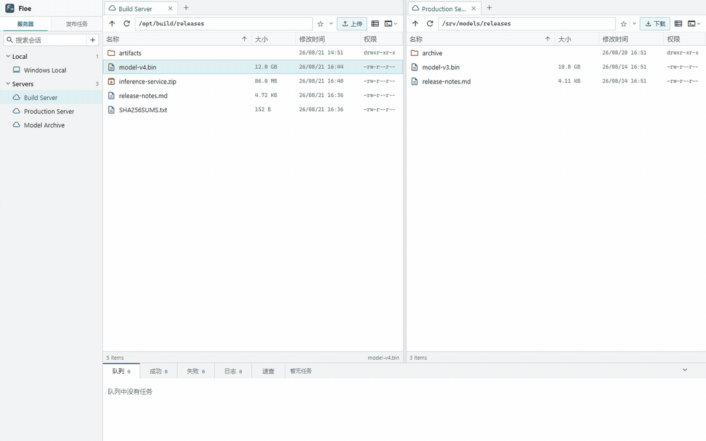

# Floe — Server File Workspace for Windows

<p align="center">
  <strong>Move and manage files across servers—from one Windows workspace.</strong>
</p>

<p align="center">
  Windows 上的多服务器文件工作台。<br>
  在一个窗口中管理本地与远程文件，从服务器 A 向服务器 B 传输文件，编辑和预览远程内容，并随时打开 SSH Terminal。
</p>

<p align="center">
  <a href="https://github.com/JerryRun/floe/releases/latest/download/Floe.exe"><strong>Download Floe for Windows</strong></a>
  ·
  <a href="https://github.com/JerryRun/floe/releases/latest">Release Notes</a>
  ·
  <a href="#quick-start">Quick Start</a>
</p>

<p align="center">
  Windows x64 · Portable · No installation required · Open source
</p>

Floe 面向在 Windows 上管理 Linux 服务器、支持 SFTP/FTP 的 NAS 和远程文件的开发者与运维人员。左右两侧可以分别打开本地目录或不同服务器，在同一个工作流中完成浏览、传输、校验、编辑、预览和 SSH 操作，不必反复切换文件管理器、终端和编辑器。



> 从服务器 A 到服务器 B，一次完成，无需手动先下载到本地再重新上传。传输由 Windows 上运行的 Floe 协调和执行。

## Why Floe?

### Server → Server

在左右面板中打开两台服务器，拖动文件或目录即可创建跨服务器传输任务。传输过程统一显示源端读取速度、目标端写入速度、进度、校验进度和预计剩余时间。

### Remote File Workspace

同时管理本地目录、SFTP 和 FTP 会话。远程文件可以直接打开、查找、编辑和预览，不需要每次先下载、修改后再上传。

### SSH + File Management

从当前 SFTP 会话一键打开 Windows Terminal。可以选择新标签、右侧窗格或下方窗格，让文件操作和服务器命令保持在同一工作流中。

## Built for reliable transfers

- **完成前校验**：写入完成后使用远端 SHA-256 或回读校验，确认内容一致后完成任务。
- **暂停与恢复**：传输队列支持暂停、恢复、删除和分类查看历史任务。
- **冲突处理**：支持覆盖、跳过、仅源文件更新时覆盖、自动重命名或逐个询问。
- **主机指纹确认**：首次连接 SFTP 服务器时显示并确认 SHA-256 主机指纹，已记录主机的密钥变化会被拒绝。
- **本地凭据加密**：会话密码和速查内容使用本机随机 AES-GCM 密钥加密保存，不写入明文。
- **可追踪错误**：操作日志记录连接、目录读取、传输、编辑和媒体播放错误的具体原因。

## Product preview

### 双面板文件工作区

本地目录和远程服务器可以自由放置在左右面板。支持多个本地或远程标签、目录书签、多文件选择和双向拖放。


### 可重复执行的发布任务

将来源、目标、过滤规则、目录结构、并发、校验和冲突策略保存为模板，重复执行常用发布或备份流程。模板不包含密码或私钥。


### 明确的文件冲突处理

目标文件已存在时，先比较来源和目标信息，再选择覆盖、跳过、仅更新时覆盖或自动重命名，也可以将选择应用到本批次后续冲突。


截图使用匿名演示数据，不包含真实服务器、账号或用户文件。

<a id="quick-start"></a>

## 5 分钟快速开始

### 1. 下载

下载最新的 Windows x64 便携版：

**[Download Floe.exe](https://github.com/JerryRun/floe/releases/latest/download/Floe.exe)**

无需安装，也不要求 Windows 主机预先安装 Go。你可以同时下载 **[SHA256SUMS.txt](https://github.com/JerryRun/floe/releases/latest/download/SHA256SUMS.txt)** 校验文件完整性。

### 2. 启动工作区

双击 `Floe.exe`。Floe Core 会在本机启动，并自动打开文件工作区。关闭工作区页面不会停止 Core，可以通过系统托盘重新打开或退出 Floe。

### 3. 添加服务器

点击左侧服务器区域的 `+`，填写会话名称、协议、地址、端口和登录信息。首次连接 SFTP 主机时，请通过服务器控制台或管理员提供的信息核对 SHA-256 主机指纹。

### 4. 打开第二个位置

在另一侧打开本地目录、另一台服务器或支持 SFTP/FTP 的 NAS。左右两侧可以是以下任意组合：

```text
Local   ↔ Server
Server  ↔ Server
Server  ↔ NAS
```

### 5. 开始传输

选择文件或目录并拖动到另一侧，或使用面板工具栏中的上传/下载按钮。Floe 会创建传输任务，并显示读取、写入和校验进度。

## What you can do

### 管理多台服务器

- 使用分组会话树保存和整理 SFTP、FTP 与本地位置。
- 在左右两侧创建多个本地或远程标签。
- 使用目录书签快速返回服务器上的常用路径。
- 修改已保存会话；已连接会话会安全断开，并在下次打开时使用新配置。

### 传输文件和目录

- 在本地、SFTP 和 FTP Provider 之间传输文件或目录。
- 使用自适应分块、请求流水线和 Provider 能力控制并发。
- 分别显示源端读取速度和目标端写入速度，重试产生的实际 I/O 也计入统计。
- 保存传输模板，用于重复执行发布、备份和同步任务。
- 任务恢复根据保存的来源与目标会话自动连接，不依赖文件面板当前是否打开会话。

### 编辑和预览远程文件

- 预览和编辑 UTF-8 文本，支持语法高亮、行号、查找替换和行列跳转。
- 保持 UTF-8 BOM、LF/CRLF，保存前检测远端冲突并使用原子写入。
- 使用源码与渲染结果分屏预览 Markdown。
- 实时渲染 HTML，并调整预览设备尺寸。
- 查看 PNG、JPEG、GIF 等图片，支持缩放、前后切换和缩略图。
- 播放 MP4，并使用内置 hls.js 播放同一 Provider 中的 M3U8/HLS 内容。

### 连接 SSH Terminal

- 在 Windows Terminal 新标签、右侧窗格或下方窗格打开当前 SFTP 会话。
- 使用一次性、短时有效的 AskPass 令牌输入已保存密码。
- 密码不会出现在 PowerShell 命令或进程参数中。
- Core 确认主机指纹后，Windows OpenSSH 使用 `accept-new` 记录首次出现的主机密钥。

### 保存服务器知识

- 使用 `Ctrl+K` 搜索或记录命令、地址、账号和操作说明。
- 支持智能短语、双引号精确搜索、上下文查看、敏感字段隐藏和全文编辑。
- 导入文本或 Markdown 文件，并将加密知识库移动到自定义目录。

### 使用命令行

GUI 与 `floe ctl` 共用同一个 `Floe.exe`。CLI 可以在浏览器工作区未打开时管理会话、读取目录和文本、查看日志，以及执行本地或跨服务器传输。

```powershell
.\Floe.exe ctl version
.\Floe.exe ctl help
.\Floe.exe ctl sessions
.\Floe.exe ctl session show <会话ID>
.\Floe.exe ctl session add --name build --host 192.0.2.10 --user root --password-stdin
.\Floe.exe ctl session update <会话ID> --keepalive --alive-interval 60 --alive-count 3
.\Floe.exe ctl session delete <会话ID>

# 服务器下载到本地
.\Floe.exe ctl get -j 4 <会话ID> /remote/file.bin C:\Downloads\file.bin

# 本地上传到服务器
.\Floe.exe ctl put -j 4 C:\build\file.bin <会话ID> /release/file.bin

# 在两个服务器之间创建一次传输工作流
.\Floe.exe ctl get -j 4 <源会话ID> /remote/file.bin <目标会话ID> /remote/copy/file.bin
.\Floe.exe ctl put -j 4 <源会话ID> /release/source.bin <目标会话ID> /release/file.bin

.\Floe.exe ctl logs --limit 100
.\Floe.exe ctl logs clear
```

首次通过 CLI 连接尚未信任的 SFTP 主机时，Floe 会显示 SHA-256 主机指纹并要求确认。`get` 和 `put` 复用 GUI 的传输引擎，完成前逐块回读并核对 SHA-256。如果已把 Floe 所在目录加入 `PATH`，命令可简写为 `floe ctl ...`。

## Security and local data

Floe 的工作区由本机 Core 提供，运行数据默认保存在 `%LOCALAPPDATA%\Floe`，不要求注册账号或连接 Floe 云服务。

| 文件 | 内容 |
| --- | --- |
| `sessions.json` | 已保存的服务器会话 |
| `session.key` | 会话凭据的本地加密密钥 |
| `tasks.json` | 传输任务与恢复信息 |
| `activity.json` | 最多 1000 条操作日志 |
| `transfer-templates.json` | 发布和传输模板 |
| `settings.json` | 启动和知识库位置设置 |
| `memories.json` / `memory.key` | 加密的速查内容及密钥 |

速查知识库可以移动到自定义目录。Floe 支持复制当前知识库后切换，也可以直接打开目标目录中已有的知识库。

## Current limitations

Floe 仍处于早期版本，当前边界包括：

- 当前提供 Windows x86_64 构建，产品界面以中文为主。
- 单次目录任务最多递归 2000 个文件。
- SFTP 上传、下载和 FTP 下载支持多路并发；为兼容不同服务器，SFTP 上传限制为一个写入槽，但单文件仍使用内部请求流水线。
- 标准 FTP 不保证对同一文件进行随机并发写入，因此 FTP 上传使用单条顺序数据流。
- FTP 控制连接每 15 秒发送保活命令；连接失效后，下一次目录、状态或写入操作会自动重新登录并安全重试一次。
- 单次网络读写空闲超过 20 秒会结束并返回明确错误，避免任务永久卡住。
- 私钥口令可以保存在会话中或通过 CLI 的 `--password-stdin` 提供，但尚未接入 Windows Credential Manager。
- SFTP 目标优先在远端计算分块 SHA-256；服务器不支持远程哈希时，Floe 会回读分块完成校验。
- PNG、JPEG 和 GIF 可以生成缩略图，其他图片格式显示标准图片图标。
- M3U8 中同一 Provider 的相对资源由 Floe 读取；外部 HTTP 地址仍可能受到来源服务器 CORS 和 Floe 安全策略限制。

更完整的协议对比、故障模型、验收指标和基准命令见 [`docs/transfer-review.md`](docs/transfer-review.md)。Windows Terminal 集成说明见 [`docs/terminal-integration-review.md`](docs/terminal-integration-review.md)。

## Optional: install as an Edge app

Floe 启动后在本机提供工作区。需要独立窗口和任务栏图标时，可以在 Microsoft Edge 中打开 Floe，然后选择“应用”→“将此站点作为应用安装”。

安装完成后，可以在 Floe 托盘菜单中关闭“启动时打开浏览器”，以后通过 Edge 应用快捷方式打开界面。需要时仍可从托盘菜单重新打开工作区、打开 PowerShell 或退出程序。

## Build from source

### 本地运行

```bash
cd floe
GOPATH="$PWD/.cache/gopath" GOCACHE="$PWD/.cache/go-build" go run ./cmd/floe
```

如果当前环境无法自动打开浏览器：

```bash
GOPATH="$PWD/.cache/gopath" GOCACHE="$PWD/.cache/go-build" \
  go run ./cmd/floe --no-open
```

终端会输出一次性登录地址，将其复制到 Windows 浏览器即可。

### 构建 Windows x86_64

```bash
chmod +x build-windows.sh
./build-windows.sh
```

产物位于 `dist/Floe.exe`。Windows 版本使用 GUI 子系统，不会显示 CMD 窗口，也不会生成 `Floe-new.exe`。

修改 `assets/floe-source.png` 后，可以重新生成 Windows 资源并构建：

```bash
./generate-resources.sh
./build-windows.sh
```

### 重新生成 README 演示素材

演示素材来自真实 Floe Web UI。需要 Windows、Microsoft Edge、PowerShell 和 WSL 中的 `ffmpeg`：

```bash
GOCACHE="$PWD/.cache/go-build" GOPATH="$PWD/.cache/gopath" \
  CGO_ENABLED=0 GOOS=windows GOARCH=amd64 \
  go build -buildvcs=false -trimpath \
  -o .cache/floe-readme-demo-server.exe ./tools/readme-demo-server

powershell.exe -NoProfile -ExecutionPolicy Bypass \
  -File "$(wslpath -w "$PWD/tools/start-readme-demo.ps1")" \
  -ServerExecutable "$(wslpath -w "$PWD/.cache/floe-readme-demo-server.exe")"

powershell.exe -NoProfile -ExecutionPolicy Bypass \
  -File "$(wslpath -w "$PWD/tools/capture-readme-demo.ps1")" \
  -BootstrapURL "http://localhost:7581/"

./tools/build-readme-demo.sh
```

## Feedback

Floe 现在最需要的不是更多功能，而是真实服务器工作流中的反馈。如果你遇到连接失败、传输异常、兼容性问题，或者 Floe 没有解决你的日常任务，请在 [GitHub Issues](https://github.com/JerryRun/floe/issues) 中告诉我们：

- 你通常管理什么类型的服务器或 NAS？
- 你想在什么位置之间传输文件？
- 哪一步让你无法继续使用？
- 你现在使用什么工具完成这项工作？

## License

Floe 使用 [Apache License 2.0](LICENSE) 发布。第三方依赖与内嵌资源的许可证清单见 [`THIRD_PARTY_NOTICES.md`](THIRD_PARTY_NOTICES.md)。
